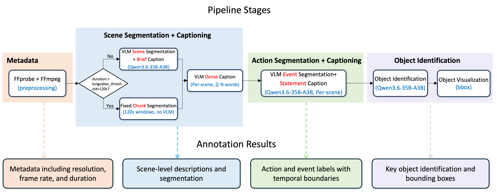

<h1 align="center">Dense Video Annotator</h1>

<p align="center">
  <a href="#"></a>
  <a href="#"></a>
  <a href="#"></a>
  <a href="#"></a>
</p>

A structured, multi-stage pipeline for **dense video annotation** with open-source vision-language models. Given raw videos, it produces four aligned annotation layers as schema-validated JSON: scene segmentation, dense scene descriptions, temporally bounded actions, and per-frame object bounding boxes. No task-specific training, no proprietary APIs.

<p align="center">
  
</p>

## Annotation Layers

| Layer | Method | Output |
|---|---|---|
| Scene segmentation | VLM for short videos, fixed-time chunks for long videos | `segments.json`, `validated.json` |
| Dense captions | Per-scene VLM with rolling prefix context | `captions.json` |
| Actions | Per-scene VLM, timestamps validated and offset in code | `actions.json` |
| Objects | Per-frame VLM grounding with two-pass NMS | `detections.json` |

The final deliverables merge these stages: `annotation.json` (scenes + captions + actions) and `objects.json` (detections).

## Installation

Requires Python 3.10+, `ffmpeg`/`ffprobe` on `PATH`, and a GPU host running vLLM.

```bash
git clone https://github.com/savebees/dense-video-annotator.git
cd dense-video-annotator
pip install -r requirements.txt
```

## Quick Start

**1. Serve the VLM**

```bash
MODEL_DIR=/path/to/Qwen3.6-35B-A3B TP_SIZE=8 GPU_DEVICES=0,1,2,3,4,5,6,7 \
  bash scripts/start_vllm.sh
```

The script serves the model on `:8000` with the OpenAI-compatible API. `TP_SIZE`, `DP_SIZE`, `GPU_MEM_UTIL`, and `GPU_DEVICES` are configurable via environment variables.

**2. Annotate**

```bash
# single video, generic prompts
python src/pipeline.py --video data/videos/example.mp4

# a directory of videos with a dataset preset
python src/pipeline.py --video_dir /path/to/videos --config configs/physics_iq.yaml

# override the prompt set from the CLI
python src/pipeline.py --video example.mp4 --dataset_type nwpu_campus

# clear per-video caches and re-run from scratch
python src/pipeline.py --video example.mp4 --force
```

**3. Inspect detections (optional)**

```bash
python scripts/visualize_objects.py --video_id example        # one video
python scripts/visualize_objects.py --all                     # every video in the output dir
```

Renders every bounding box onto its frame under `<output_dir>/<video_id>/viz/`.

## Repository Structure

```
dense-video-annotator/
├── src/
│   ├── pipeline.py              # entry point: orchestration, caching, schema validation
│   ├── scene_segmentation.py    # segmentation, boundary validation, captioning
│   ├── actions.py               # per-scene action annotation
│   └── object_detection.py      # per-frame grounding + two-pass NMS
├── prompts/                     # per-dataset prompt packages with generic fallback
├── configs/                     # one self-contained YAML per dataset
├── schemas/                     # JSON Schemas for both output documents
├── preprocess/                  # metadata + frame extraction
├── utils/                       # frame packing (time-base mux), VLM client, parsing
├── scripts/
│   ├── start_vllm.sh            # vLLM serving script
│   └── visualize_objects.py     # render detections onto frames
└── eval/                        # reference-free caption evaluation (see eval/EVAL.md)
```

## Output

Each video produces a self-contained directory:

```
<output_dir>/<video_id>/
├── metadata.json                # ffprobe metadata
├── frames/                      # extracted jpgs (index = timestamp × fps)
├── segments.json                # stage cache: raw segmentation
├── validated.json               # stage cache: boundary-validated segments
├── captions.json                # stage cache: segments + dense captions
├── actions.json                 # stage cache: segments + captions + actions
├── detections.json              # stage cache: raw per-frame detections
├── annotation.json              # scenes + captions + actions
└── objects.json                 # per-frame detections
```

## Configuration

Each dataset (or type of video) gets its own YAML under `configs/`, selected with `--config`. `configs/default.yaml` covers generic videos. Frequently tuned keys:

| Key | Default | Meaning |
|---|---|---|
| `dataset_type` | `default` | Selects the prompt package from `prompts/` |
| `video_fps` | `1.0` | Frame extraction rate, also the detection density |
| `frame_max_long_side` | `672` | Frame resize for VLM input |
| `long_video_threshold_sec` | `120` | Beyond this, switch to fixed-chunk surveillance mode |
| `min_description_words` | `100` | Caption length floor (with bounded retries) |
| `min_action_duration` | `0.5` | Drop actions shorter than this |
| `detection_nms_threshold` | `0.5` | Pass 1 NMS: same-label duplicate IoU |
| `detection_cross_label_iou_threshold` | `0.9` | Pass 2 NMS: label-drift duplicate IoU |
| `detection_concurrency` | `32` | Concurrent per-frame detection requests |

## Annotating a New Dataset

Two steps, e.g. for `my_dataset`:

1. **Prompts**: add `prompts/my_dataset.py` and register it in `_MODULES` in `prompts/__init__.py`. Override only the prompt constants that need dataset-specific wording, everything else falls back to `prompts/general.py`.
2. **Config**: copy `configs/default.yaml` to `configs/my_dataset.yaml`, set `dataset_type: my_dataset`, and tune the keys above.

Then run:

```bash
python src/pipeline.py --video_dir /path/to/videos --config configs/my_dataset.yaml
```

## Evaluation

The repository includes a self-contained, reference-free caption evaluation module under [`eval/`](eval/EVAL.md). In brief: a text LLM decomposes each caption into atomic claims, an independent visual judge (a different model family from every system under test) verdicts each claim against uniformly sampled frames, and a per-clip salient-item list drives coverage. The headline metric is **F1 over faithfulness (precision) and coverage (recall)**, complemented by richness statistics and a CLIP alignment score. See [`eval/EVAL.md`](eval/EVAL.md) for the full protocol, robustness handling, and run instructions.

## Citation

If you find this project useful, please cite:

```bibtex
@misc{savebees2026densevideoannotator,
  author       = {savebees},
  title        = {Dense Video Annotator: A Structured Multi-Stage Pipeline for Dense Video Annotation},
  year         = {2026},
  howpublished = {\url{https://github.com/savebees/dense-video-annotator}}
}
```

## License

This project is licensed under the [MIT License](LICENSE).