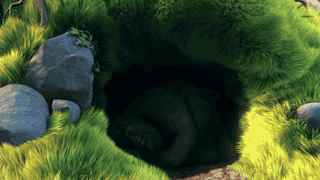

<h1 align="center">VideoCap</h1>

<p align="center">
  <a href="../README.md"><ins>English</ins></a> | 简体中文
</p>

<p align="center">
  
  
  
</p>

VideoCap 为视频生成密集标注，包含概述、主体、背景、镜头和细节五类描述，以及带时间边界的语义事件，video-eval 和 video-qa 为模型训练提供标注质量评估与问答数据生成能力。


## 📣 示例

<p align="center">
  <a href="../assets/big-buck-bunny-demo.mp4">
    
  </a>
  <br>
  <sub>Copyright © 2008 Blender Foundation · <a href="https://peach.blender.org/about/">CC BY 3.0</a></sub>
</p>

### VideoCap 输出

```json
{
  "schema_version": "videocap/v0.2",
  "video_id": "bbb-0038-0078",
  "duration_ms": 40000,
  "captions": {
    "short": "大兔子在昏暗的洞穴中醒来，走进明亮的草地，感受清晨、嗅闻一簇白花，并注意到一只紫色蝴蝶。",
    "main_object": "这只灰色的大兔子缓缓从洞穴中抬起头，爬到阳光下坐直身体，伸展手臂和后背，面带轻松的微笑环顾草地，俯身嗅闻白色花朵，随后转向一只紫色蝴蝶。",
    "background": "场景从大树下被草覆盖的昏暗洞穴转向阳光照耀的草地，周围分布着岩石、茂密的树木、起伏的绿色山丘、白色雏菊、紫色花朵和清澈的蓝天，小鸟与昆虫让宁静的环境更具生气。",
    "camera": "视频以洞穴的固定远景开场，在兔子醒来时切至特写，随后用中景和低角度镜头记录它走出洞穴并伸展身体，再交替使用面部与花朵特写、越肩草地镜头和高角度镜头，跟随它将注意力转向蝴蝶。",
    "detailed": "固定远景呈现大树下安静而昏暗的洞穴。兔子起初几乎隐藏在黑暗中，随后将头探入光线，睁开眼睛并望向洞口。它爬出洞穴，在入口旁的草地坐下，在温暖的阳光中缓慢伸展手臂、肩膀和后背。完全站起后，它仰头呼吸，带着平静的微笑环顾开阔草地，镜头在低角度和面部特写之间切换。它转向一片白花，俯身嗅闻花朵，画面从越肩视角切至花瓣间的面部特写。一只紫色蝴蝶在花旁飞舞，兔子注意到它，将视线移向草地，并跟随蝴蝶移动，视频以高角度镜头结束。"
  },
  "events": [
    {"event_id": "event_0000", "start_ms": 0, "end_ms": 7000, "evidence_frames_ms": [1000, 6000], "caption": "固定远景呈现大树下安静而昏暗的洞穴。兔子起初几乎隐藏在黑暗中，随后将头探入光线，睁开眼睛并望向洞口。"},
    {"event_id": "event_0001", "start_ms": 7000, "end_ms": 16000, "evidence_frames_ms": [8000, 15000], "caption": "兔子爬出洞穴，在入口旁的草地坐下，在温暖的阳光中缓慢伸展手臂、肩膀和后背。"},
    {"event_id": "event_0002", "start_ms": 16000, "end_ms": 25000, "evidence_frames_ms": [17000, 24000], "caption": "完全站起后，兔子仰头呼吸，带着平静的微笑环顾开阔草地，镜头在低角度和面部特写之间切换。"},
    {"event_id": "event_0003", "start_ms": 25000, "end_ms": 33000, "evidence_frames_ms": [26000, 32000], "caption": "兔子转向一片白花，俯身嗅闻花朵，画面从越肩视角切至花瓣间的面部特写。"},
    {"event_id": "event_0004", "start_ms": 33000, "end_ms": 40000, "evidence_frames_ms": [34000, 39000], "caption": "一只紫色蝴蝶在花旁飞舞。兔子注意到它，将视线移向草地，并跟随蝴蝶移动，视频以高角度镜头结束。"}
  ]
}
```

### video-qa

生成的 QA 示例：

```json
[
  {
    "qa_id": "bbb-0038-0078__global_main_object",
    "task": "action_recognition",
    "question": "视频中的主体依次执行了哪些动作？",
    "answer": "这只灰色的大兔子缓缓从洞穴中抬起头，爬到阳光下坐直身体，伸展手臂和后背，面带轻松的微笑环顾草地，俯身嗅闻白色花朵，随后转向一只紫色蝴蝶。",
    "provenance": {"event_ids": ["event_0000", "event_0001", "event_0002", "event_0003", "event_0004"], "evidence_frames_ms": []}
  },
  {
    "qa_id": "bbb-0038-0078__global_background",
    "task": "scene_transition",
    "question": "视频中的场景和背景如何变化？",
    "answer": "场景从大树下被草覆盖的昏暗洞穴转向阳光照耀的草地，周围分布着岩石、茂密的树木、起伏的绿色山丘、白色雏菊、紫色花朵和清澈的蓝天，小鸟与昆虫让宁静的环境更具生气。",
    "provenance": {"event_ids": ["event_0000", "event_0001", "event_0002", "event_0003", "event_0004"], "evidence_frames_ms": []}
  },
  {
    "qa_id": "bbb-0038-0078__global_detailed",
    "task": "temporal_reasoning",
    "question": "视频中的事件从开始到结束如何发展？",
    "answer": "固定远景呈现大树下安静而昏暗的洞穴。兔子起初几乎隐藏在黑暗中，随后将头探入光线，睁开眼睛并望向洞口。它爬出洞穴，在入口旁的草地坐下，在温暖的阳光中缓慢伸展手臂、肩膀和后背。完全站起后，它仰头呼吸，带着平静的微笑环顾开阔草地，镜头在低角度和面部特写之间切换。它转向一片白花，俯身嗅闻花朵，画面从越肩视角切至花瓣间的面部特写。一只紫色蝴蝶在花旁飞舞，兔子注意到它，将视线移向草地，并跟随蝴蝶移动，视频以高角度镜头结束。",
    "provenance": {"event_ids": ["event_0000", "event_0001", "event_0002", "event_0003", "event_0004"], "evidence_frames_ms": []}
  },
  {
    "qa_id": "bbb-0038-0078__event_0003__grounding",
    "task": "temporal_grounding",
    "question": "兔子俯身嗅闻一片白花这一事件发生在什么时间？",
    "answer": "25000 毫秒到 33000 毫秒。",
    "provenance": {"event_ids": ["event_0003"], "evidence_frames_ms": [26000, 32000]}
  }
]
```

### video-eval

video-eval 使用五维 caption F1、事件边界 IoU、事件 caption F1、时间覆盖率、全局与事件一致性，以及基于参考标注的幻觉率评估标注质量。

```json
{
  "video_id": "bbb-0038-0078",
  "accepted": true,
  "caption_f1_by_dimension": {
    "short": 0.706,
    "main_object": 0.585,
    "background": 0.580,
    "camera": 0.527,
    "detailed": 0.943
  },
  "matched_events": 5,
  "candidate_events": 5,
  "reference_events": 5,
  "metrics": {
    "global_caption_f1": 0.668,
    "event_boundary_iou": 0.902,
    "event_caption_f1": 0.930,
    "temporal_coverage": 1.0,
    "temporal_coverage_delta": 0.100,
    "consistency": 1.0,
    "hallucination": 0.242
  }
}
```

## 🚀 快速开始

VideoCap 需要 Python 3.10+、`ffmpeg`，以及 OpenAI-compatible VLM 和 LLM 接口。克隆仓库后，使用 `uv` 安装：

```bash
git clone https://github.com/savebees/VideoCap.git
cd VideoCap
uv sync --locked
```

也可以使用标准虚拟环境和 `pip`：

```bash
python -m venv .venv
source .venv/bin/activate
python -m pip install -e .
```

在 [`configs/videocap.json`](../configs/videocap.json) 中设置 provider 和模型，导出 `api_key_env` 指定的 API key，然后运行：

```bash
export SILICONFLOW_API_KEY="..."
uv run videocap run videos.jsonl \
  --config configs/videocap.json \
  --output-root runs
```

使用 `pip` 时，请在已激活的虚拟环境中将 `uv run videocap` 替换为 `videocap`。

使用 Claude Code、Codex 或其他 coding agent 时，可直接粘贴：

> 请在此仓库中使用我的 OpenAI-compatible VLM 和 LLM provider 与模型配置 VideoCap，将所有 API key 保存在环境变量中，根据我的视频目录生成 `videos.jsonl`，并完成单视频 smoke test。

## 📦 数据集准备

可以直接从视频目录生成 manifest；辅助脚本会递归扫描视频，并通过 `ffprobe` 读取每个视频的时长：

```bash
uv run python scripts/prepare_dataset.py /path/to/videos --output videos.jsonl
```

生成的 UTF-8 JSONL 每行对应一个视频：

```json
{"video_id":"video_001","video_path":"videos/video_001.mp4","duration_ms":68320}
{"video_id":"video_002","video_path":"videos/video_002.mp4","duration_ms":124500}
```

相对路径以 manifest 所在目录为基准解析。每个 `video_id` 必须唯一，视频文件必须存在，`duration_ms` 的单位为毫秒。

## TODO

- [ ] 完成 video-eval，支持可配置的参考标注评估指标和可复现的数据集级质量报告。
- [ ] 完成 video-qa，支持保留事件与证据帧来源的 grounded QA 数据生成。

## 🤝 致谢

感谢以下开源项目对 VideoCap 设计的启发。

- [AuroraCap](https://github.com/wenhaochai/aurora)：VDC 五维视频 caption 分类与 prompt 设计。
- [MVBench](https://github.com/OpenGVLab/Ask-Anything)：面向能力的视频时序理解任务分类。
- [TempCompass](https://github.com/llyx97/TempCompass)：时序感知维度与 QA 任务设计。

## License

VideoCap 使用 [MIT License](../LICENSE) 发布。
